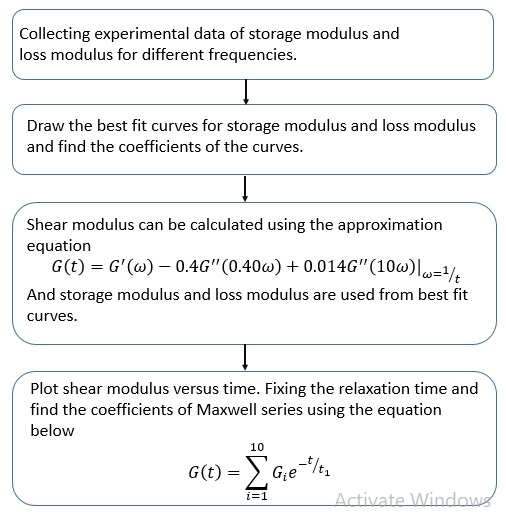

### Lasso Regression to find the constitutive law of viscoelastic materials

Data-driven parameter identification brings a new era of material computation that can avoid the complexity and approximation of conventional techniques. The objective of this research is to determine the coefficient of the Maxwell series for laminated glass as a visco-elastic material from experimental data. This data has been collected from dynamic tests on composite glass specimens with a PVB interlayer. The two-ply composite glasses were laminated with a PVB interlayer by Roberglass. This experimental data provided storage modulus and loss modulus values for different frequencies. The mechanical properties of laminated glass are governed by the coupling capability of the interlayer, which depends on the shear modulus of the polymer. The shear modulus, in turn, depends on the storage modulus and loss modulus. In conventional techniques, calculating shear modulus from storage and loss modulus is difficult and complex. For avoiding this complexity, researchers commonly use approximate relations, which is suitable when the time range is not sufficiently wide. Otherwise, it leads to some considerable errors. The main purpose of this research is to calculate shear modulus from experimental data using a machine-learning technique for avoiding complexity and approximate the relation of conventional techniques.

  

